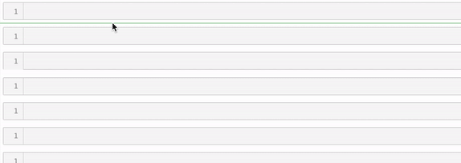
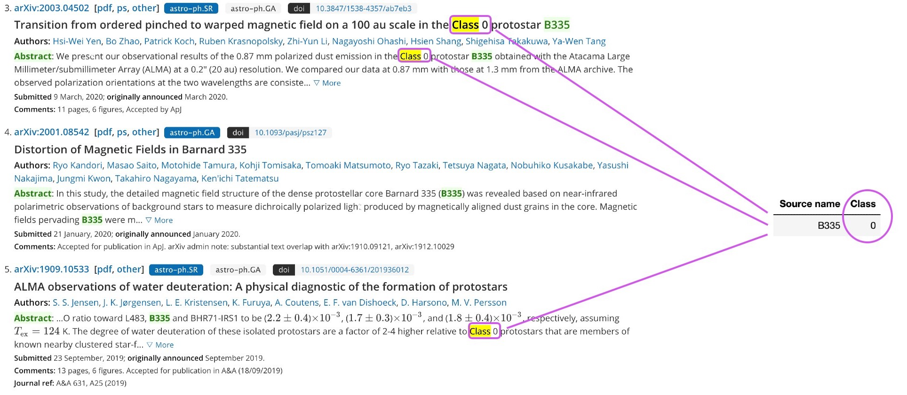

# Machine Learning for Astronomy
This project will consist of several machine learning based algorithms aimed to
1. *classify* astronomical objects
1. simplify the *search* in [ASA](https://almascience.nrao.edu/asax/).

These processes are based on the object's visual appearence.

## Subprojects
- [ ] Creating simulated data set of disks
- [x] Fetching data from [JVO](https://jvo.nao.ac.jp/portal/alma/archive.do)
- [x] Identifying star classification using [arXiv](https://arxiv.org/)

## Motivation
The ALMA Science Archive consists of more than 1 PB data. When knowing properties like the source's name, position or observation date it is easy to search through the archive to find the interesting observations. This is however not the case when the aim is to find observations of sources with a specific visual appearance. The algorithms collected in this project aims to enable such a filtering process.

## Screenshots
#### Subproject: Fetching data from JVO (Notebooks/JVO_demo.ipynb)

#### Subproject: Identify star classification (Notebooks/Find Information from ArXiv)

